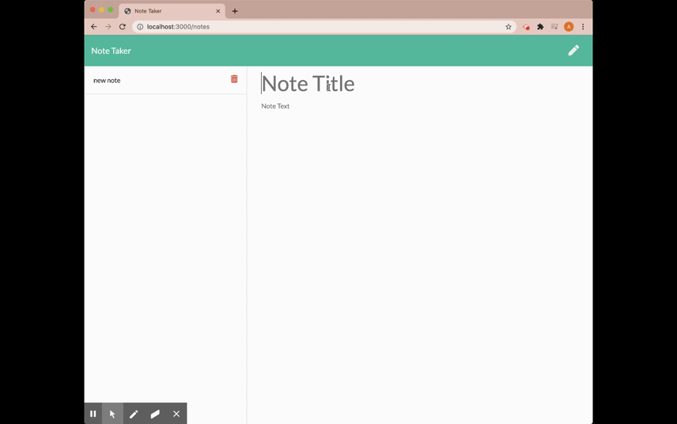

# Note Taker 


This application is for users that need to keep track of a lot of information, it's easy to forget or be unable to recall something important. Being able to take persistent notes allows users to have written information available when needed.

## Example 



## Installation 
- You can begin with `npm i `
- Make sure `node-modules` has `express` dependencies, 
  if not `npm i express`

## Technologies 
- HTML
- CSS
- NODE.JS
- The application has a `db.json` file on the backend that uses to store and retrieve notes using the `fs` module.

## User Story
```md
AS A user, I want to be able to write and save notes

I WANT to be able to delete notes I've written before

SO THAT I can organize my thoughts and keep track of tasks I need to complete
```
## Link to the application 

## Questions?

* My GitHub : [Aika Kuo](https://github.com/aikakuo)

* LinkedIn : [Aika Kuo](https://linkedin.com/in/aika-kuo-b42b53bb)
